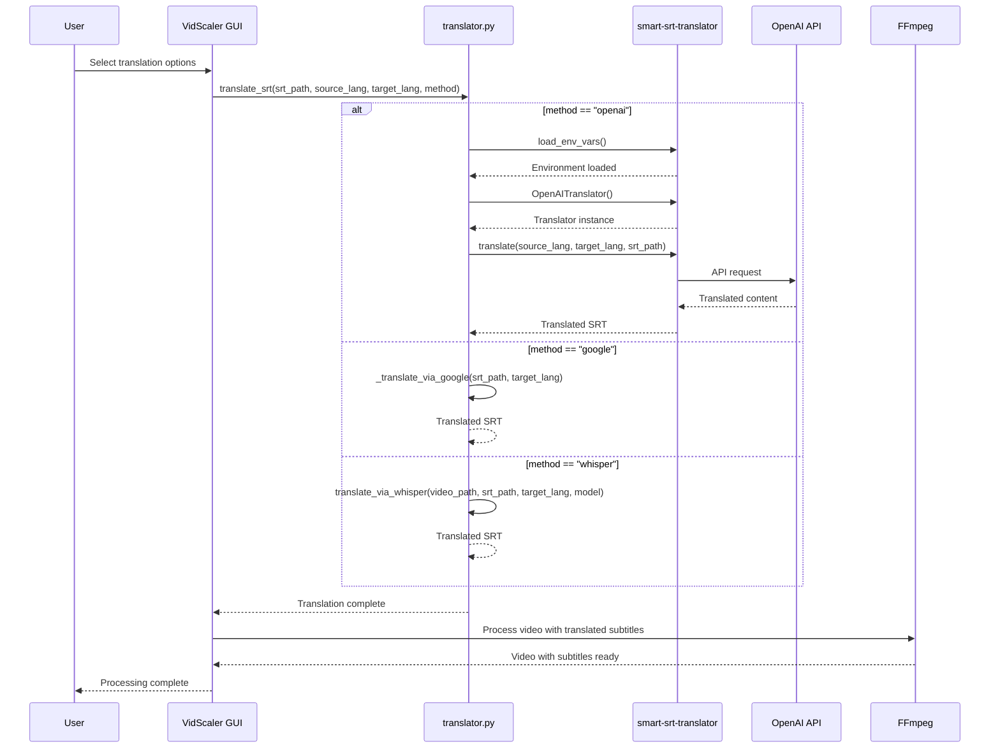

# VidTools - Claude Development Guide

## Projektübersicht
Video Processing Toolbox: GUI-Anwendung fuer Video-Skalierung, Untertitel,
Transkription, Uebersetzung und GIF-Erstellung. Basiert auf VidScalerSubtitleAdder.

## Technische Anforderungen
- Python 3.7+ mit tkinter (standard)
- FFmpeg im System PATH
- Windows 11 kompatibel

## Setup Commands

### Virtuelle Umgebung erstellen und aktivieren (Windows):
```bash
python -m venv .venv
.venv\Scripts\activate
```

### Dependencies installieren:
```bash
pip install -r requirements.txt
```

### Anwendung starten:
```bash
python vidscaler.py
```

## Windows Batch Starter

**WICHTIG**: Das Projekt hat eine `start.bat` für einfachen Doppelklick-Start!
- ✅ Automatische Virtual Environment Aktivierung
- ✅ Startet `python vidscaler.py`
- ✅ Konsole bleibt offen für Fehlerausgaben

## Projektstruktur
```
VidTools/
├── vidscaler.py          # Haupt-GUI-Anwendung
├── video_processor.py    # FFmpeg-Interface
├── utils.py              # Hilfsfunktionen (ToolTip, etc.)
├── audio_transcriber.py  # Audio-zu-SRT Transkriptor mit Whisper
├── translator.py         # SRT-Übersetzungs-Engine
├── subtitle_validator.py # Validierung: Original vs. übersetzte SRT
├── validation_dialog.py  # Tkinter-Dialog bei Übersetzungsproblemen
├── text_extractor.py     # Text-Exzerpt aus SRT-Dateien
├── debug_logger.py       # Debug-Logging für Entwicklung
├── requirements.txt      # Abhängigkeiten
├── start.bat             # Windows Doppelklick-Starter
├── docs/                 # GitHub Pages Landing Page
│   └── index.html
├── .venv/                # Virtual Environment
├── README.md             # Benutzeranleitung
└── CLAUDE.md             # Diese Datei
```

## Entwicklungsrichtlinien
- **Einfachheit**: Minimale Abhängigkeiten, tkinter-Standard
- **Windows-First**: Pfade mit os.path, Windows-Pfad-Handling
- **Error Handling**: Robuste FFmpeg-Fehlerbehandlung
- **Type Hints**: Für bessere Code-Qualität
- **Logging**: Für Debugging und Benutzer-Feedback

## Core Features
1. **File Selection**: Einfache Videodatei-Auswahl
2. **Resolution Display**: Aktuelle Video-Dimensionen anzeigen
3. **Smart Scaling**: Dropdown mit geraden Pixel-Werten
4. **FFmpeg Integration**: subprocess-basierte Videoverarbeitung
5. **Progress Feedback**: Status-Updates für Benutzer
6. **✅ Subtitle Integration**: .srt-Dateien unterhalb des Videos einbrennen
7. **✅ Audio Transcription**: Video → Audio → Text → SRT mit Whisper
8. **✅ Translation Engine**: SRT-Übersetzung mit mehreren Sprachen
9. **✅ Dual Subtitles**: Original oben, Übersetzung unten im Video
10. **✅ Smart Split**: Videos in Teile splitten mit konfigurierbarer Überlappung
11. **✅ UI-Vereinfachung**: 4 klare Aktions-Buttons, kompakte Übersetzungs-Sektion, Tooltips

## FFmpeg Integration
**Normale Skalierung:**
- Befehl: `ffmpeg -i input.mp4 -vf scale=WIDTH:-1 output_scaled.mp4`
- Gerade Pixelwerte (durch 2 teilbar) für Kompatibilität
- Proportionale Skalierung mit -1 für Höhe

**✅ Untertitel-Integration (funktioniert perfekt):**
- Befehl: `ffmpeg -i input.mp4 -vf "scale=WIDTH:-2,pad=iw:ih+100:0:0:black,subtitles=temp_subtitles.srt" output_subtitled.mp4`
- Temporäre Datei-Kopie löst Windows-Pfad-Probleme
- Video wird um 100px nach unten erweitert
- Optimale Schriftgröße und Lesbarkeit

**🎯 Doppelte Untertitel-Integration (SRT → ASS Pipeline):**
- **SRT → ASS Konvertierung**: `ffmpeg -sub_charenc UTF-8 -i input.srt output.ass` für Style-Kontrolle
- **Dynamisches Padding**: Skaliert mit Video-Breite (top: max(80, 140×ratio), bot: max(90, 160×ratio))
- **Dynamische Schriftgröße**: `max(9, round(13 × (0.4 + scale_ratio × 0.6)))` → konsistent über alle 3 Modi
- **Positioning**: Original TopCenter (Alignment=8), Übersetzung BottomCenter (Alignment=2)
- **Windows-Pfad-Fix**: Temporäre Dateien im cwd, `os.path.basename()` in FFmpeg-Filtern
- **Befehl**: `ffmpeg -i input.mp4 -vf "scale=WIDTH:-2,pad=iw:ih+300:0:140:black,ass=original.ass,ass=translated.ass" output.mp4`

## Testing Approach
- Manuelle Tests mit verschiedenen Video-Formaten
- FFmpeg-Verfügbarkeit prüfen
- Windows-Pfad-Kompatibilität testen

## Deployment
- Standalone Python-Script
- Optional: PyInstaller für .exe-Distribution

## ✅ Aktueller Status (Phase 7b ERFOLGREICH → PR #12 gemergt!)
- **Basis-Skalierung**: ✅ Funktioniert perfekt
- **Untertitel-Einfügung**: ✅ Funktioniert perfekt - dynamische Schriftgröße!
- **GUI**: ✅ Alle Controls implementiert und funktionsfähig
- **Windows-Kompatibilität**: ✅ Pfad-Probleme gelöst
- **🎉 Audio-Transkription**: ✅ LIVE GETESTET - funktioniert perfekt!
- **🎉 Übersetzungsqualität**: ✅ OpenAI-Fallback behoben, Batching in v0.1.4, Validation Safety-Net aktiv

## 🆕 Phase 2 Features (Audio Transcription) - ✅ LIVE GETESTET!
- **✅ Audio Extraction**: FFmpeg extrahiert Audio aus Video (16kHz WAV)
- **✅ Whisper Integration**: OpenAI Whisper für präzise Spracherkennung - FUNKTIONIERT!
- **✅ Multi-Language**: Deutsch, Englisch, Auto-Erkennung
- **✅ Model Selection**: Tiny/Base/Small - Geschwindigkeit vs. Genauigkeit
- **✅ Segment Editor**: Timeline-basierte Text-Bearbeitung - BENUTZERFREUNDLICH!
- **✅ SRT Export**: Direkter Export zurück zur Haupt-App
- **✅ Seamless Integration**: "Audio transkribieren" Button in Haupt-GUI - PERFEKT!

## Installation (Alle Dependencies)
```bash
pip install openai-whisper matplotlib pydub translators
pip install 'smart-srt-translator[openai]>=0.1.4'
```

## 🎉 Phase 3 Features (Übersetzung) - ✅ PRODUKTIONSREIF!
- **✅ Übersetzungs-API**: `translators` library mit Google Translate Backend
- **✅ SRT → ASS Pipeline**: Robuste Konvertierung mit Style-Kontrolle
- **✅ Doppelte Untertitel**: Original oben, Übersetzung unten im Video
- **✅ Sprachauswahl**: Dropdowns für Quell- und Zielsprache (9 Sprachen)
- **✅ Übersetzungsmodi**: "Original + Übersetzung" oder "Nur Übersetzung"
- **✅ GUI Integration**: Übersetzungs-Sektion mit Aktivierungs-Checkbox
- **✅ Multi-Threading**: Übersetzung und Video-Verarbeitung in separaten Threads
- **🎯 Windows-Pfad-Fixes**: Alle FFmpeg-Pfadprobleme gelöst durch cwd-Temporärdateien

## 🚀 Phase 4 Features (Bidirektionale Whisper-Übersetzung) - ✅ IMPLEMENTIERT!
- **✅ WhisperTranslator-Klasse**: Audio-Extraktion + Whisper-Transkription in Zielsprache
- **✅ Smart Timing-Mapping**: Whisper-Segmente auf Original-SRT-Timing gemappt
- **✅ Triple Translation Methods**: OpenAI (beste Qualität) vs Google Translate (schnell) vs Whisper (English-only)
- **✅ GUI Method-Selection**: Dropdown mit dynamischen Whisper-Model-Optionen
- **✅ Model Caching**: Whisper-Modelle werden wiederverwendet für Performance
- **✅ Robustes Cleanup**: Automatische Bereinigung aller temporären Audio-Dateien
- **🔄 Qualitäts-Test**: Whisper-Übersetzung braucht noch Feintuning/manuelle Nachbearbeitung

## 🔄 Workflow (aktuell)
1. **Video auswählen** → Analysieren
2. **Audio transkribieren** → SRT wird automatisch gesetzt
3. **Sprache + Methode** wählen (Übersetzungs-Sektion, immer sichtbar)
4. **Button wählen:**
   - "Mit Original-Untertiteln" → Original-SRT unten im Video
   - "Mit Übersetzung" → Nur übersetzte Untertitel unten
   - "Mit Original + Übersetzung" → Original oben, Übersetzung unten

## 🎉 Phase 5 Features (Production Quality & UX) - ✅ FERTIG!
- **✅ Smart-SRT-Translator Integration**: Lokales `smart_translation.py` durch PyPI-Modul ersetzt
- **✅ Optimierte GUI-Defaults**: Fenstergröße, Audio-Transkription (Base+English), Übersetzung (OpenAI+EN-Source)
- **✅ Benutzerfreundlichkeit**: Alle Standard-Einstellungen auf häufigste Use-Cases optimiert
- **✅ Modular Architecture**: Externe Dependencies über offizielle Package-Manager

## 🎬 Phase 6 Features (Smart Split) - ✅ LIVE GETESTET!
- **✅ Video-Splitting**: Automatisches Aufteilen in konfigurierbare Segmente
- **✅ Überlappung**: Einstellbare Sekunden-Überlappung zwischen Teilen (für nahtlose Übergänge)
- **✅ GUI-Integration**: Checkbox + Spinboxen für Teillänge (1-60 min) und Überlappung (0-30 sek)
- **✅ Stream-Copy**: Schnelles Splitting ohne Re-Encoding (`-c copy`)
- **✅ Workflow-Integration**: Split erfolgt automatisch nach Skalierung/Untertitel/Übersetzung
- **✅ Smart Detection**: Kein Split wenn Video kürzer als gewählte Teillänge
- **✅ Erfolgsmeldung**: Liste aller erstellten Teile in der Bestätigung

### Smart Split FFmpeg-Befehl
```bash
ffmpeg -ss START -i input.mp4 -to DURATION -c copy -avoid_negative_ts make_zero output_partXX.mp4
```

### Segment-Berechnung (Beispiel: 30 Min Video, 5 Min Teile, 2 Sek Overlap)
| Teil | Start | Ende | Effektive Länge |
|------|-------|------|-----------------|
| 1 | 0:00 | 5:02 | 5:02 |
| 2 | 5:00 | 10:02 | 5:02 |
| 3 | 10:00 | 15:02 | 5:02 |
| ... | ... | ... | ... |

## 🎨 Phase 7 Features (UI-Vereinfachung) - ✅ IMPLEMENTIERT!
- **✅ Button-Vereinfachung**: 4 klare Aktions-Buttons statt verwirrender Checkbox/Radio-Logik
  - "Video skalieren" (nur Skalierung)
  - "Mit Original-Untertiteln" (Original-SRT unten)
  - "Mit Übersetzung" (nur übersetzte Untertitel unten, Fix für Issue #6)
  - "Mit Original + Übersetzung" (Original oben, Übersetzung unten)
- **✅ Übersetzungs-Sektion vereinfacht**: Kompakte Zeile (Von/Nach/Methode) statt verschachtelter Frames
- **✅ Checkbox "Übersetzung aktivieren" entfernt**: Nicht mehr nötig, Button-Wahl bestimmt Modus
- **✅ Radio-Buttons entfernt**: Modus wird durch Button-Wahl bestimmt
- **✅ Tooltip-System**: ToolTip-Klasse in utils.py für Timing-Checkbox
- **✅ Debug-Code bereinigt**: ASS-Kopien und FFmpeg-Debug-Print entfernt
- **✅ _ensure_wrapstyle**: Fehlender Aufruf im "Nur Übersetzung"-Branch hinzugefügt
- **✅ Issue #6 gelöst**: "Nur Übersetzung"-Modus verwendet jetzt `subtitles=` statt `ass=` Filter. Doppelte Untertitel waren VLC Auto-Load-Verhalten (keine Code-Bug)

### Hinweis: VLC Auto-Load Verhalten

VLC lädt automatisch externe Untertitel-Dateien, wenn sie denselben Basisnamen wie das Video haben. Wenn `_translated.mp4` im selben Ordner wie eine `_translated.srt` abgespielt wird, zeigt VLC die Untertitel möglicherweise doppelt an.

**Lösungen:**

- Video in einen anderen Ordner verschieben
- SRT-Datei umbenennen/verschieben
- In VLC: Untertitel > Unterspur > Deaktivieren

## 🔧 Phase 7b: Translation Quality & Dynamic Subtitles (PR #12) - ✅ GEMERGT!
- **✅ Parameter-Fix**: `min_seg_dur` → `min_segment_duration`, `reading_wpm` → `reading_speed_wpm` (stiller Fallback auf Google behoben)
- **✅ Timing-Default**: `preserve_timing=True` statt `expand_timing` als Standard für Deutsche Übersetzungen
- **✅ Validation Safety-Net**: `subtitle_validator.py` + `validation_dialog.py` → erkennt leere Segmente und Timing-Drift nach Übersetzung
- **✅ Dynamische Schriftgröße**: Alle 3 Untertitel-Modi nutzen jetzt `max(9, round(13 × (0.4 + scale_ratio × 0.6)))`
- **✅ DRY-Refactoring**: `_convert_srt_to_ass`, `_ensure_wrapstyle`, `_tweak_ass_style` als Klassenmethoden extrahiert
- **✅ smart-srt-translator v0.1.4**: Batching (25 Segmente/Batch), Retry-Logik, gpt-4o statt gpt-4o-mini
- **✅ Code-Rabbit Fixes**: 76 Smart Quotes → ASCII (SyntaxError!), UTF-8 `errors='replace'`, Docstrings 91.5%

### Validation Safety-Net Architektur
```python
# subtitle_validator.py
def validate_translation(original_path, translated_path) -> ValidationResult:
    # Vergleicht Segment-Anzahl, erkennt leere Segmente (≥2%), Timing-Drift

# validation_dialog.py
class ValidationDialog:
    # Tkinter-Dialog: "Abbrechen" oder "Trotzdem einbrennen"
    # Thread-safe via root.after(0, ...) + threading.Event
```

## 📋 Phase 8 Roadmap (Future)
- **🔧 Temp-Dateinamen absichern**: `NamedTemporaryFile` statt manuelle Pfade (Race-Condition-Schutz) → eigener PR
- **🔧 Translator-Refactoring**: OpenAI Auto/Explicit Code-Duplikation in translator.py auflösen → eigener PR
- **🎯 Translation Editor**: GUI-Fenster zum manuellen Korrigieren von Übersetzungen
- **📝 Segment-by-Segment Editing**: Wie AudioTranscriber, aber für übersetzte Texte
- **🔄 Export-Integration**: Korrigierte Übersetzung direkt in Video-Pipeline

## 🛠️ Technische Implementierung (Phase 3 Lösung)

### FFmpeg Windows-Pfad Problematik
**Problem:** Windows-Pfade mit Laufwerksbuchstaben (`C:\path`) verursachen Parsing-Fehler in FFmpeg-Filtern
**Lösung:** Temporäre Dateien im aktuellen Arbeitsverzeichnis + `os.path.basename()` für Filter

### SRT → ASS Konvertierungs-Pipeline
```python
# Alle drei als Klassenmethoden von VideoProcessor (DRY-Refactoring aus PR #12)

def _convert_srt_to_ass(self, src_srt: str, dst_ass: str):
    subprocess.run([self.ffmpeg_path, "-sub_charenc", "UTF-8", "-i", src_srt, dst_ass])

@staticmethod
def _tweak_ass_style(ass_path: str, *, alignment: int, margin_v: int,
                     font_size: int = 13, outline: int = 2):
    # ASS V4+ Format Style-Zeile modifizieren
    # Felder: Fontsize(2), Outline(16), Shadow(17), Alignment(18), MarginV(21)
```

### Optimierte Style-Parameter
- **FontSize**: Dynamisch: `max(9, round(13 × (0.4 + scale_ratio × 0.6)))` → alle 3 Modi konsistent
- **Margins**: L=2, R=2 (vorher 10/10) - mehr Platz für Text
- **WrapStyle**: 3 - gleichmäßigere Textumbrüche
- **Alignment**: TopCenter(8) vs BottomCenter(2)
- **Padding**: Dynamisch skaliert, gerade Werte für Codec-Kompatibilität

### Video-Filter-Chain
```bash
ffmpeg -i video.mp4 -vf "
  scale=WIDTH:-2,
  pad=iw:ih+300:0:140:black,
  ass=filename=original.ass,
  ass=filename=translated.ass
" output.mp4
```

### Robustes Cleanup
```python
finally:
    for p in [temp_original_srt, temp_translated_srt, temp_original_ass, temp_translated_ass]:
        if p and os.path.exists(p):
            try: os.remove(p)
            except: pass
```

## 🛠️ Phase 4 Technische Implementierung (Whisper-Übersetzung)

### WhisperTranslator-Architektur
```python
class WhisperTranslator:
    def translate_via_whisper(self, video_path, original_srt_path, target_lang, model_size):
        # 1. Audio extrahieren (16kHz WAV für Whisper)
        # 2. Whisper-Modell laden + cachen
        # 3. Original-SRT-Timing als Referenz parsen
        # 4. Whisper in Zielsprache transkribieren
        # 5. Smart Timing-Mapping auf Original-Segmente
        # 6. Übersetzte SRT erstellen + cleanup
```

### Smart Timing-Mapping Algorithm
```python
def _map_whisper_to_original_timing(whisper_segments, original_segments):
    # Overlap-Detection: Whisper-Segment ∩ Original-Segment
    # Kombiniert alle überlappenden Whisper-Texte pro Original-Segment
    # Fallback: "[Keine Übersetzung]" wenn keine Überlappung
```

### GUI Method-Selection
- **Dynamic Widgets**: Whisper-Model-Dropdown erscheint nur bei Whisper-Auswahl
- **Dependency-Check**: Automatische Erkennung ob Whisper/Translators verfügbar
- **Smart State-Management**: Widget-States abhängig von Methoden-Auswahl

## 🏗️ Translation Architecture (Analysis by Code-Rabbit)

### Note: Architecture analysis and sequence diagram provided by Code-Rabbit AI Code Review



This sequence diagram illustrates the translation workflow, showing how the application integrates multiple translation methods through a unified interface. The OpenAI translation path demonstrates proper provider initialization through the smart-srt-translator package, while fallback methods (Google Translate, Whisper) provide alternative translation options.
